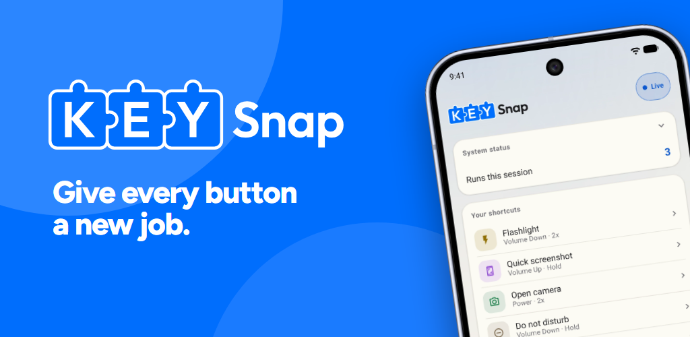
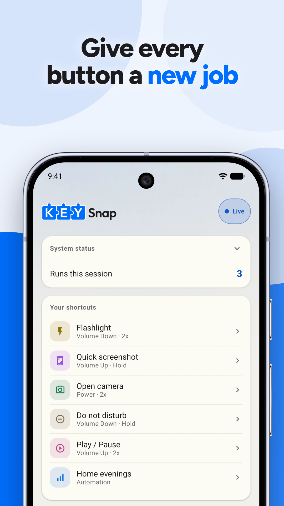
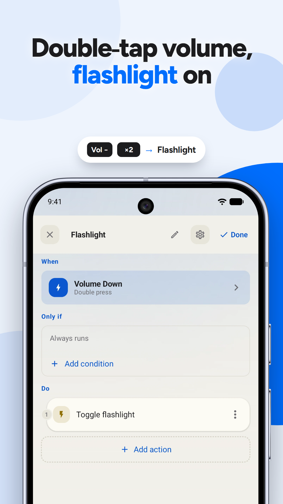
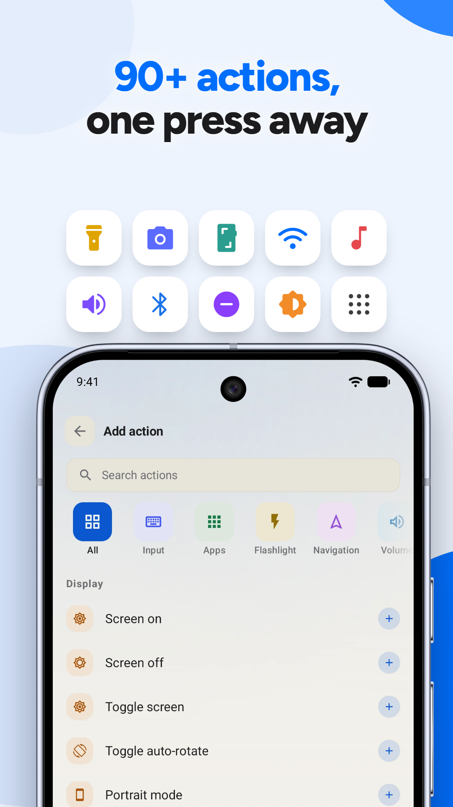
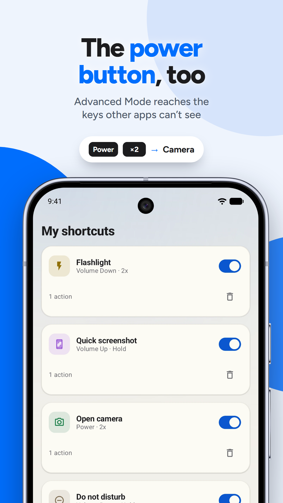
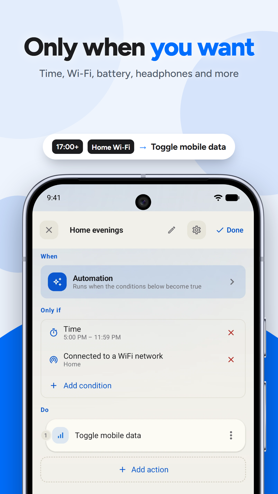

<p align="center">
  
</p>

<h1 align="center">KeySnap</h1>

<p align="center">
  Give every button on your Android phone a new job.<br>
  Volume, power, camera, assistant: any physical key you can press, KeySnap can remap.
</p>

<p align="center">
  <a href="LICENSE"></a>
  
  
</p>


<p align="center">
  
  
  
  
  
</p>

## Why KeySnap?

Android hands a normal app only the keys it feels like sharing. Volume and headset buttons are easy; the power button, the assistant button and the extra keys many manufacturers add are not, and the moment the phone decides your app is idle, the background service that listens for them is killed. Most remappers either stop there or ask for root.

KeySnap takes a third route. Everyday shortcuts run through Android's own accessibility key filter, no root needed. For everything Android hides, **Advanced Mode** uses the phone's built-in Wireless Debugging to start a small helper with shell privileges that reads keys directly from the kernel and keeps running even after the app itself is closed. Nothing is rooted, nothing is patched, and turning it off removes it.

## What can I make?

A **shortcut** binds one or more triggers to one or more actions. Some examples:

| Press | Does |
|---|---|
| Volume Down, twice | Toggle the flashlight |
| Volume Up, hold | Take a screenshot |
| Power, twice | Open the camera *(Advanced Mode)* |
| Volume Down, hold | Turn on Do Not Disturb |
| No key at all, after 17:00 on your home Wi‑Fi | Toggle mobile data |

Shortcuts run in the background, and the whole thing works without an account, a cloud, or an internet connection.

## How much control do I have?

**Triggers.** Any hardware key Android reports: volume, power, camera, the assistant button, headset buttons, keys on a Bluetooth keyboard or game controller, and unlabelled OEM buttons you can name yourself. Each key can be a single press, a double press or a long press, and one shortcut can chain several. There is also an **Automation** trigger with no key at all: it fires when its conditions become true.

**Actions.** More than 90, in twelve groups: input and gestures, apps, flashlight, navigation, volume, display, media, connectivity, keyboard, device, sound and automation. Every action's settings are visible in the editor before it runs, and privileged ones such as shell commands, intents and HTTP requests show the exact command or URL they will execute.

**Conditions.** Attach an *Only if* list to any shortcut: time of day, day of week, charging state, battery level, Wi‑Fi network, Bluetooth device, headphones, dark mode, Do Not Disturb, ringer mode, screen and lock state, orientation, which app is in the foreground, whether media is playing, and more. Around sixty in total.

**Appearance.** Light, dark and sepia themes. The interface ships in English, Arabic, German, Spanish, French, Hindi, Italian, Portuguese (Brazil), Russian and Turkish.

## Advanced Mode

Android only lets a normal app see the keys it decides to share, which leaves the power button, the assistant button and many OEM buttons out of reach. Advanced Mode fixes that without root.

The app pairs with your phone's own **Wireless Debugging** over the local network and starts a small helper, the *bridge*, with shell privileges. The bridge reads key presses straight from the kernel and runs your shortcuts on its own, so it keeps working after Android closes the app in the background. It reads its configuration from a file the app writes, keeps no record of what you press, never leaves your network, and deletes itself when you turn Advanced Mode off. It does not survive a reboot; the app re-launches it the next time you open it.

Input capture is strictly read-only. The bridge listens to the kernel's event stream and never grabs or forges input.

## Permissions

KeySnap asks for a permission only when you use the feature that needs it, and each one is a switch you turn on yourself in Android's settings.

- **Accessibility service.** The only way an app can see hardware key presses. It is restricted to reading screen content from the system Settings app alone, and uses that solely to read the pairing code from the Wireless Debugging dialog during Advanced Mode setup.
- **Run in the background and notifications.** So Android does not put the app to sleep, and so setup can show the pairing prompt.
- **Location.** Android only reveals the Wi‑Fi network name to apps holding it, so the *connected to Wi‑Fi network* condition needs it. The app never reads your position.
- **Bluetooth, Do Not Disturb access, usage access, modify system settings, display over other apps.** Each unlocks one group of actions or conditions and is requested from inside that feature.
- **Camera** is deliberately not requested. The flashlight uses an API that needs no permission.

The full list with reasons is in the [privacy policy](https://nicholas-arda.github.io/keysnap-privacy/).

## Privacy

No servers, no accounts, no analytics, no crash reporting. Your shortcuts and key presses never leave the device. The free version shows ads through Google AdMob and the Pro purchase goes through Google Play Billing; neither receives anything the app records. Details: [privacy policy](https://nicholas-arda.github.io/keysnap-privacy/).

## Building from source

```bash
git clone https://github.com/Nicholas-Arda/KeySnap.git
cd KeySnap
./gradlew :app:installDebug       # builds the debug APK and installs it on the connected device
./gradlew :app:testDebugUnitTest :bridge:test
```

Android Studio with its bundled JDK is all you need. `:app` is the Kotlin and Jetpack Compose application; `:bridge` is the small Java helper that runs with shell privileges in Advanced Mode, shipped inside the app as `bridge.dex`.

## FAQ

**Is it free?** The free version has two shortcuts and shows ads. Pro is a one-time purchase through Google Play that removes both limits; there is no subscription.

**Does it need root?** No. Everyday shortcuts use the accessibility service; Advanced Mode uses Wireless Debugging, a feature already in Android's Developer options. Nothing on the phone is modified.

**Which phones does it run on?** Any phone or tablet on Android 11 or newer. The keys you can map depend on what your phone reports: volume and headset buttons work everywhere, power and manufacturer buttons need Advanced Mode.

**Why does Google Play warn me about the accessibility permission?** Play shows that warning for every app that uses an accessibility service. In KeySnap it is the only way to see hardware key presses. The service is restricted to the system Settings app and cannot read anything you type or any other app's screen.

**Will it break my volume buttons?** Only the presses you map. A key with a shortcut is taken over by default so it does not also do its normal job; each shortcut has a *Consume original input* switch if you want the key to do both. Keys that only Advanced Mode can see, such as power, are never blocked; the shortcut runs alongside what the phone already does.

**Does it drain the battery?** It listens for key events instead of polling, so it costs almost nothing while idle. Advanced Mode's helper is a single small process that sleeps until a key is pressed.

**Does it work with the screen off?** With Advanced Mode, yes: the helper reads the kernel directly. Without it, Android decides which keys reach an accessibility service while the screen is off, so it varies by device and key.

**Does it work with Bluetooth headphones and game controllers?** Yes, any device Android reports as a keyboard, headset or gamepad. Unlabelled buttons can be recorded and given a name.

**Why did my shortcuts stop after a day?** Some manufacturers (Xiaomi, Oppo, Samsung and others) kill background apps aggressively. Home shows a setup card with the two switches that stop this. Advanced Mode is immune because its helper is not part of the app process.

**Why does Advanced Mode turn off after a reboot?** The helper is a process, not a service, so a reboot ends it. Open KeySnap once after rebooting and it starts again with the same pairing.

**Does it need internet?** No. The app never contacts a server of its own. The only network use is pairing with your own phone over your local network, the ads in the free version, and any URL you put into a shortcut yourself.

**Can I back up my shortcuts?** They travel with Android's own backup, so they come back when you restore a phone. The Advanced Mode pairing is deliberately not backed up, because it authorises one specific device.

**Can I export/import my shortcuts to a file?** Coming soon.

**Can I share my shortcuts with friends?** Coming soon.

## Support

Bugs and feature requests go to [GitHub Issues](https://github.com/Nicholas-Arda/KeySnap/issues) or to [support@ardasenn.com](mailto:support@ardasenn.com). Include your Android version, phone model and whether Advanced Mode was on.

## Disclaimer

Shell commands, intents and HTTP requests you put into a shortcut run with the privileges you gave the app, exactly as you wrote them. Advanced Mode relies on Android's Wireless Debugging, a developer feature; on some phones it also switches off automatically on reboot. KeySnap is not affiliated with Google or any phone manufacturer.

## Contributing

Issues and pull requests are welcome. Before a change to key handling or the bridge, please read the safety rules the project follows:

- Input capture stays read-only. Never grab or inject evdev input.
- Privileged actions show the user exactly what will run and pass it through unchanged.
- No secrets in logs: pairing codes, tokens, addresses and the arguments of user-authored actions never reach a log.
- The accessibility service reads the Settings app only.
- Turning Advanced Mode off must leave nothing running.

Translations live in `app/src/main/res/values-*/strings.xml`.

## Licence

KeySnap is free software under the [GNU General Public License v3.0](LICENSE). Google AdMob and Google Play Billing are the only third-party services it talks to, and only for showing ads and processing the Pro purchase.
